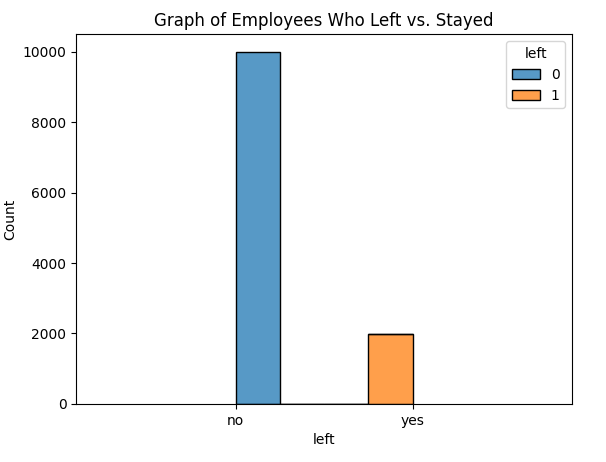
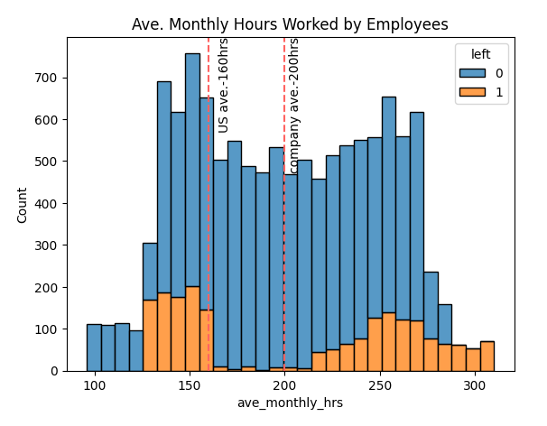
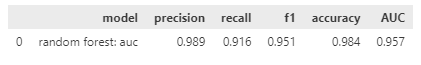
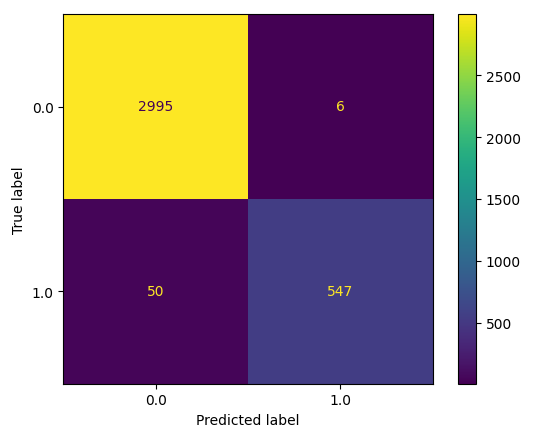
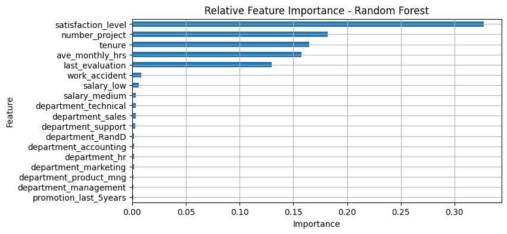

# Employee Churn Analysis at Salifort Motors

This repository contains the code, documentation, and results for the end of course Capstone Project completed as part of the **Google Advanced Data Analytics Certificate**. The project focuses on analyzing an HR employee dataset from Salifort Motors, a fictional company, with the objective of understanding the factors that impact employee churn. Exploratory data analysis (EDA) and predictive classification models were developed to gain insights and predict whether an employee would leave the company.

## Project Overview

Employee churn, the voluntary or involuntary departure of employees from a company, can have significant impacts on business performance and productivity as well as have significant financial implications for the company due to the resources that go into the hiring process. 

The goal of this project was to analyze the HR employee dataset of Salifort Motors to identify factors that contribute to employee turnover. By understanding these factors, the company can take proactive measures to retain valuable employees and improve overall employee satisfaction.

## Data Understanding
The HR dataset contains 15000 rows and 10 features. The variable of interest that the project aimed to understand and explore was `left` which is a binary column indicating whether or not an employee left the company. There is a class imbalance in the data that is addressed in the project notebook.

## Project Insights and Modelling

This project revealed that employees at Salifort are being overworked. US standard monthly average working hours are 160hrs/month however Salifort Motors employee average monthly hours exceeded this at 200hrs/month.

In order to contruct a classification model that could effectively be utilised by the company an iterative modelling process was conducted. This produced a final random forest model which proved to be very reliable it's ability to classify whether an employee would leave the company or not. It achieved the following performance scores:

The modeling process also revealed that the dataset features which had the biggest impact on whether an employee would leave or not were:
1. `satisfaction_level`
2. `number_project`
3. `tenure`
4. `ave_monthly_hrs`
5. `last_evaluation`

## Conclusion 

By leveraging exploratory data analysis and building predictive classification models, valuable insights were gained, and accurate predictions of employee churn could be made. 

Salifort motors can use this information to make data driven decision regarding their employees and company policy regarding work hours. 

Some recommendations include:
* Limiting the number of projects that employees are allowed to work on.
* Updating and clarifying company policy regarding overtime work and remuneration which rewards hard work. 
* The company should either reward employees for working longer hours, or not require them to do so. 
* Management could be more explicit about workload and time off expectations 
* Company work culture needs to be better understood through company-wide engagement on all levels and in all teams
* Evaluation scores should be awarded in a way that rewards employees for behavioral patterns that are conducive to desired company culture and healthy work habits. 
